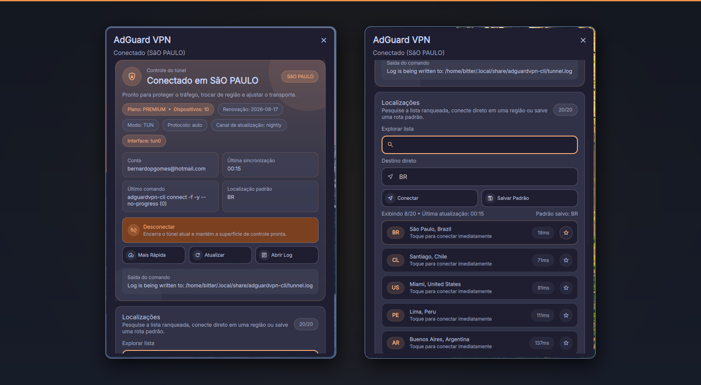

<!-- markdownlint-disable MD033 -->
# 🛡️ AdGuard VPN — DankMaterialShell Plugin

> Control, monitor, and configure **AdGuard VPN** directly from your DankBar — no terminal needed. **Language / Idioma:** English is the primary documentation language. A Portuguese (Brazil) version is provided below for the same user-facing guidance.

<p align="center">
  
</p>

---

## ✨ Features

| Category              | What you get                                                                     |
| --------------------- | -------------------------------------------------------------------------------- |
| **Live monitoring**   | Real-time status, account info, config, and ranked locations                     |
| **One-click actions** | Connect / Disconnect / Fastest / Location quick-connect                          |
| **Runtime config**    | Mode (TUN / SOCKS), Protocol (Auto / HTTP2 / QUIC), Update channel, DNS upstream |
| **Location tools**    | Search & filter, city/country quick-connect, favorites                           |
| **Resilience**        | Auto-connect on startup, auto-reconnect on tunnel drop                           |
| **Diagnostics**       | Last command log, tunnel log viewer, contextual error hints                      |
| **Multilingual**      | 22 languages with safe fallback (EN, PT-BR + 20 additional locales)              |
| **Robust parsers**    | ANSI-safe, multi-format CLI output parsing                                       |

---

## 📋 Requirements

| Dependency        | Version                                                                             |
| ----------------- | ----------------------------------------------------------------------------------- |
| DankMaterialShell | `>= 1.4.0`                                                                          |
| `adguardvpn-cli`  | Any recent version — [install guide](https://github.com/AdguardTeam/AdGuardVPNCLI/) |
| AdGuard account   | Logged in (`adguardvpn-cli login`)                                                  |

---

## 🚀 Installation

### 1. Clone into DMS plugins directory

```bash
git clone https://github.com/bernardopg/dms-adguard-vpn-plugin.git \
  ~/.config/DankMaterialShell/plugins/adguardVPplugin
```

### 2. Reload & enable

```bash
dms ipc plugins reload adguardVPplugin
dms ipc plugins enable adguardVPplugin
```

### 3. Add to DankBar

Open **DMS Settings → Widgets** and add **AdGuard VPN** to your bar.

---

## ⚙️ Settings

All settings are configurable through the DMS plugin settings screen.

| Setting                | Type   |     Default      | Description                                                                                                                                                                                                            |
| ---------------------- | ------ | :--------------: | ---------------------------------------------------------------------------------------------------------------------------------------------------------------------------------------------------------------------- |
| `adguardBinary`        | string | `adguardvpn-cli` | CLI binary name or absolute path                                                                                                                                                                                       |
| `refreshIntervalSec`   | int    |       `8`        | Status polling interval (3–120 s)                                                                                                                                                                                      |
| `locationsCount`       | int    |       `20`       | How many locations to fetch (5–100)                                                                                                                                                                                    |
| `connectStrategy`      | enum   |    `fastest`     | Default connect behavior: `fastest` or `location`                                                                                                                                                                      |
| `defaultLocation`      | string |        —         | Preferred location (city, country, or ISO code)                                                                                                                                                                        |
| `ipStack`              | enum   |      `auto`      | Force `ipv4` or `ipv6` on connect                                                                                                                                                                                      |
| `autoRefreshLocations` | bool   |      `true`      | Periodically refresh ranked server list                                                                                                                                                                                |
| `autoConnectOnStartup` | bool   |     `false`      | Auto-connect when plugin / session starts                                                                                                                                                                              |
| `autoReconnectOnDrop`  | bool   |     `false`      | Auto-reconnect when the tunnel drops unexpectedly                                                                                                                                                                      |
| `showLocationInBar`    | bool   |      `true`      | Display connection text next to bar icon                                                                                                                                                                               |
| `languageOverride`     | enum   |      `auto`      | UI language: `auto`, `en_US`, `pt_BR`, `es_ES`, `zh_CN`, `hi_IN`, `ar`, `bn_BD`, `fr_FR`, `de_DE`, `ja_JP`, `ru_RU`, `ko_KR`, `id_ID`, `tr_TR`, `vi_VN`, `it_IT`, `pl_PL`, `nl_NL`, `fa_IR`, `th_TH`, `ur_PK`, `ms_MY` |

---

## 🏗️ Project Structure

```text
adguardVPplugin/
├── plugin.json                 # Manifest & permissions
├── qmldir                      # QML singleton registration
├── AdGuardVpnWidget.qml        # Bar pill + popout UI
├── AdGuardVpnSettings.qml      # DMS settings screen
├── AdGuardVpnService.qml       # Singleton: polling, actions, state
├── AdGuardVpnParsers.js        # CLI output parsers (status, config, license, locations)
├── AdGuardVpnI18n.qml          # Localization singleton
├── i18n/
│   ├── en.js                   # English (fallback)
│   ├── pt_BR.js                # Português (Brasil)
│   ├── es_ES.js                # Espanol
│   ├── zh_CN.js                # Chinese (Simplified)
│   ├── hi_IN.js                # Hindi
│   ├── ar.js                   # Arabic
│   ├── bn_BD.js                # Bengali
│   ├── fr_FR.js                # French
│   ├── de_DE.js                # German
│   ├── ja_JP.js                # Japanese
│   ├── ru_RU.js                # Russian
│   ├── ko_KR.js                # Korean
│   ├── id_ID.js                # Indonesian
│   ├── tr_TR.js                # Turkish
│   ├── vi_VN.js                # Vietnamese
│   ├── it_IT.js                # Italian
│   ├── pl_PL.js                # Polish
│   ├── nl_NL.js                # Dutch
│   ├── fa_IR.js                # Persian
│   ├── th_TH.js                # Thai
│   ├── ur_PK.js                # Urdu
│   ├── ms_MY.js                # Malay
│   └── README.md               # Translation guide
├── scripts/
│   ├── check-i18n-keys.mjs     # i18n key parity checker
│   ├── test-parsers.mjs        # Parser unit tests (status/license/config/locations)
│   ├── lint-markdown.sh        # Markdown linter
│   └── validate-qml.sh         # QML syntax validator
├── docs/
│   ├── ARCHITECTURE.md         # Component design & data flow
│   ├── COMMANDS.md             # CLI command mapping
│   ├── RELEASE_CHECKLIST.md    # Release process
│   └── releases/               # Per-version release notes
├── CHANGELOG.md
├── CONTRIBUTING.md
└── LICENSE                     # MIT
```

For detailed architecture and data flow, see [docs/ARCHITECTURE.md](./docs/ARCHITECTURE.md).
For the CLI command map, see [docs/COMMANDS.md](./docs/COMMANDS.md).

---

## 🔒 Security & Permissions

The plugin **only** executes local CLI commands through the DMS process API.
No credentials are stored — secrets live in `adguardvpn-cli`'s own config.
Network traffic is entirely managed by the CLI itself.

| Permission       | Purpose                           |
| ---------------- | --------------------------------- |
| `settings_read`  | Load plugin settings              |
| `settings_write` | Persist plugin settings           |
| `process`        | Execute `adguardvpn-cli` commands |

---

## 🔍 Troubleshooting

<details>
<summary><strong>adguardvpn-cli unavailable</strong></summary>

Verify the binary is accessible:

```bash
adguardvpn-cli --version
```

If using a custom path, update it in plugin settings (`adguardBinary`).

</details>

<details>
<summary><strong>Auth / session issues</strong></summary>

Authenticate interactively, then refresh in the widget:

```bash
adguardvpn-cli login
```

</details>

<details>
<summary><strong>Location connect errors (city / country / ISO not found)</strong></summary>

- Hit **Refresh** in the widget to update the location list.
- Prefer the visible **city, country** label from the list, or an ISO code when you want the CLI to choose within a country.
- If a saved preferred location is stale, update it in settings.

</details>

<details>
<summary><strong>Plugin not loading</strong></summary>

```bash
dms ipc plugins status  adguardVPplugin
dms ipc plugins reload  adguardVPplugin
```

</details>

---

## 💻 Development

Follow the [DMS plugin development guide](https://danklinux.com/docs/dankmaterialshell/plugin-development).

Recommended loop:

```bash
# edit code…
dms ipc plugins reload adguardVPplugin
```

Quality checks before committing:

```bash
node scripts/check-i18n-keys.mjs   # i18n key parity
node scripts/test-parsers.mjs      # parser unit tests
bash scripts/lint-markdown.sh       # markdown lint
bash scripts/validate-qml.sh       # QML syntax
```

---

## 🌐 Localization

This plugin is now officially **multilang** and ships with:

- **Full locales:** English, Português (Brasil)
- **Extended locales with English fallback:**
  Español, 中文 (简体), हिन्दी, العربية, বাংলা, Français, Deutsch, 日本語, Русский, 한국어,
  Indonesia, Türkçe, Tiếng Việt, Italiano, Polski, Nederlands, فارسی, ไทย, اردو, Bahasa Melayu

Adding or extending locales is straightforward — see [i18n/README.md](./i18n/README.md).

---

## 🤝 Contributing

See [CONTRIBUTING.md](./CONTRIBUTING.md) for workflow, quality checks, and release process.

---

## 📦 Publishing

Follow the [Release Checklist](./docs/RELEASE_CHECKLIST.md), then:

```bash
git tag v1.3.0
git push origin main --tags
```

Submit to the [DMS Plugin Registry](https://github.com/AvengeMedia/dms-plugin-registry).

---

## 📄 License

[MIT](./LICENSE) — Bernardo Gomes

---

## Português (Brasil)

> Controle, monitore e configure o **AdGuard VPN** diretamente pela DankBar — sem precisar abrir o terminal.

### Recursos

| Categoria | O que você recebe |
| --- | --- |
| **Monitoramento ao vivo** | Status, conta, configuração e localizações ranqueadas em tempo real |
| **Ações em um clique** | Conectar / Desconectar / Mais rápida / Conectar por localização |
| **Configuração em runtime** | Modo (TUN / SOCKS), Protocolo (Auto / HTTP2 / QUIC), canal de atualização e DNS upstream |
| **Ferramentas de localização** | Busca, filtro, favoritos e conexão por cidade/país |
| **Resiliência** | Auto-conectar ao iniciar e auto-reconectar em queda do túnel |
| **Diagnóstico** | Último comando, visualizador do log do túnel e dicas contextuais de erro |
| **Multilíngue** | 22 idiomas com fallback seguro (EN, PT-BR + 20 locales adicionais) |
| **Parsers robustos** | Remoção de ANSI e parsing de múltiplos formatos de saída do CLI |

### Requisitos

| Dependência | Versão |
| --- | --- |
| DankMaterialShell | `>= 1.4.0` |
| `adguardvpn-cli` | Qualquer versão recente; veja o guia oficial de instalação |
| Conta AdGuard | Sessão iniciada com `adguardvpn-cli login` |

### Instalação

```bash
git clone https://github.com/bernardopg/dms-adguard-vpn-plugin.git \
  ~/.config/DankMaterialShell/plugins/adguardVPplugin

dms ipc plugins reload adguardVPplugin
dms ipc plugins enable adguardVPplugin
```

Depois, abra **DMS Settings → Widgets** e adicione **AdGuard VPN** à barra.

### Configurações

Todas as configurações ficam na tela de settings do plugin no DMS.

| Configuração | Tipo | Padrão | Descrição |
| --- | --- | --- | --- |
| `adguardBinary` | string | `adguardvpn-cli` | Nome do binário ou caminho absoluto do CLI |
| `refreshIntervalSec` | int | `8` | Intervalo de polling de status (3–120 s) |
| `locationsCount` | int | `20` | Quantidade de localizações carregadas (5–100) |
| `connectStrategy` | enum | `fastest` | Estratégia padrão: `fastest` ou `location` |
| `defaultLocation` | string | — | Localização preferida: cidade, país ou ISO |
| `ipStack` | enum | `auto` | Forçar IPv4 ou IPv6 nas conexões |
| `autoRefreshLocations` | bool | `true` | Atualizar lista de localizações periodicamente |
| `autoConnectOnStartup` | bool | `false` | Conectar automaticamente ao iniciar plugin/sessão |
| `autoReconnectOnDrop` | bool | `false` | Reconectar se o túnel cair inesperadamente |
| `showLocationInBar` | bool | `true` | Mostrar texto/localização ao lado do ícone |
| `languageOverride` | enum | `auto` | Idioma da UI; `auto` segue o locale do sistema |

### Segurança e permissões

O plugin executa apenas comandos locais pelo processo do DMS. Credenciais não são armazenadas pelo plugin; elas ficam no próprio `adguardvpn-cli`.

| Permissão | Finalidade |
| --- | --- |
| `settings_read` | Ler configurações do plugin |
| `settings_write` | Persistir configurações do plugin |
| `process` | Executar comandos locais do `adguardvpn-cli` |

### Solução de problemas

Se o CLI aparecer como indisponível, verifique:

```bash
adguardvpn-cli --version
```

Se usa caminho customizado, atualize `adguardBinary` nas configurações. Para problemas de sessão, rode `adguardvpn-cli login`. Para erros de localização, atualize a lista no widget e prefira o rótulo visível `cidade, país`; use ISO quando quiser deixar o CLI escolher dentro do país.

### Desenvolvimento

Loop recomendado:

```bash
dms ipc plugins reload adguardVPplugin
```

Checks antes de commitar:

```bash
node scripts/check-i18n-keys.mjs
node scripts/test-parsers.mjs
bash scripts/lint-markdown.sh
bash scripts/validate-qml.sh
```

### Licença

[MIT](./LICENSE) — Bernardo Gomes
